## 简介

SpriteJS 是跨平台的高性能图形系统，它能够支持web、node、桌面应用和小程序的图形绘制和实现各种动画效果。

SpriteJS <sup>Next</sup> 是SpriteJS的新版本，在浏览器端支持 webgl2 渲染，并可向后兼容降级为 webgl 和 canvas2d。

## 特性

- 像操作DOM对象一样操作画布上的图形元素
- WebGL2渲染
- 多图层处理图形、文本、图像渲染
- DOM事件代理、自定义事件派发
- 使用ES6+语法和面向对象编程
- OffscreenCanvas和Web Worker[多线程渲染](/zh-cn/guide/worker)
- 结构化对象树，对[d3](https://github.com/d3/d3)引擎友好，能够无缝使用
- [服务端渲染](/zh-cn/guide/platforms)
- [Vue](http://vue.spritejs.org)

## 安装和使用

如果你使用NPM进行包管理，可以直接使用npm命令安装

```bash
npm install spritejs
```

安装完之后可以使用ESModule加载：

```js
import * as spritejs from 'spritejs';
```

由于spritejs是跨平台的，如果在node环境中跑，需要自行安装依赖库[node-canvas](https://github.com/Automattic/node-canvas)

```bash
npm install canvas@next
```

如果你在浏览器中直接使用，可以使用CDN版本

```html
<script src="https://unpkg.com/spritejs@3/dist/spritejs.js"></script>
```

如果你要在node服务端使用spritejs渲染，你需要安装[node-canvas](https://github.com/Automattic/node-canvas)

可能需要先安装一下依赖：

```bash
sudo apt-get install libcairo2-dev libjpeg-dev libpango1.0-dev libgif-dev build-essential g++
```

然后安装node-canvas 2.x：

```bash
npm install canvas@next
```

## 3D 扩展

SpriteJS<sup>Next</sup> 通过[3D扩展库](https://github.com/spritejs/sprite-extend-3d)加载并渲染3D模型。

可以通过CDN加载扩展库：

```html
<script src="https://unpkg.com/spritejs@3/dist/spritejs.es.min.js"></script>
<script src="https://unpkg.com/sprite-extend-3d/dist/sprite-extend-3d.js"></script>
```

或通过NPM加载：


```js
import {Scene} from 'spritejs';
import {Cube, shaders} from 'sprite-extend-3d';
```

## 架构

SpriteJS <sup>Next</sup> 提供若干类基础精灵元素，可以像操作DOM元素一样在图层上操作它们。



## 与旧版本主要差异

### 增强

- 丰富了精灵类型
  - 在原有的 Sprite、Path、Label、Group基础上增加了Polyline、Ellipse、Arc、Ring、Regular、Triangle、Rect等矢量图形类元素。
  - 将元素分为块元素（Block）和矢量路径元素（Path）两个大类，有着不同的盒模型和渲染方式。

- 支持WebGL渲染
  - 因为默认使用WebGL2渲染，大大提升性能。

- 支持多线程
  - 可以使用LayerWorker多线程模式，让不同的Layer运行在不同的线程。

### 改变策略

- 简化了Scene的适配方式
  - 将原有的resolution和viewport配置简化为width和height，相当于原有的resolution，viewport默认根据容器自动适配。
  - 适配模式简化为`static, scale, stickyWidth, stickyHeight, stickyTop, stickyBottom, stickyLeft, stickyRight`八种。

### 弱化

- 弱化了Label类
  - 去掉了对多行文字和文字排版的支持。

- 暂时不支持布局
  - 暂不支持原有的flex布局，在后续版本中考虑让块元素支持flex布局。

- 不支持CSS
  - 去掉了CSS支持。

## 基本用法

```js
const {Scene, Sprite} = spritejs;

const container = document.querySelector('#stage');
const scene = new Scene({container, width: 3080, height: 800, mode: 'stickyTop'});

const layer = scene.layer();

const robot = new Sprite('https://p5.ssl.qhimg.com/t01c33383c0e168c3c4.png');

robot.attr({
  anchor: [0, 0.5],
  pos: [0, 0],
});

robot.animate([
  {pos: [0, 0]},
  {pos: [0, 300]},
  {pos: [2700, 300]},
  {pos: [2700, 0]},
], {
  duration: 5000,
  iterations: Infinity,
  direction: 'alternate',
});

layer.append(robot);
```

<iframe src="/demo/#/doc/basic" height="300"></iframe>